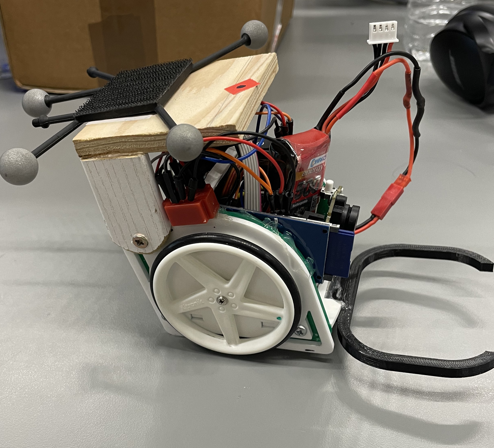
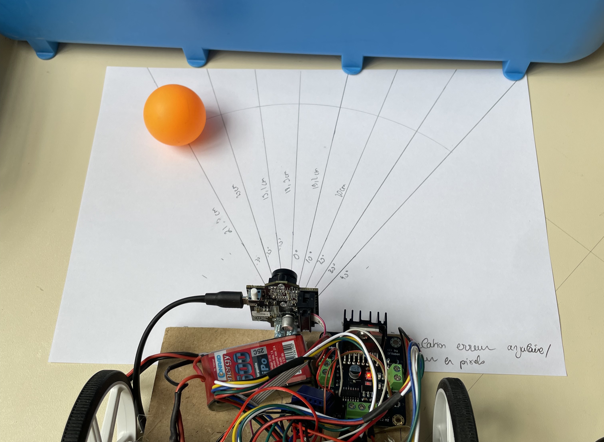

# Autonomous Table Tennis Ball Collecting Robot

[](LICENSE)
[]()

**📖 [Complete Technical Report & Portfolio](https://promaaa.github.io/portfolio/ball-collecting-writeup.html)**

## Table of Contents

- [Overview](#overview)
- [Key Achievements](#key-achievements)
- [System Architecture](#system-architecture)
- [Control System](#control-system)
- [Results Summary](#results-summary)
- [Project Structure](#project-structure)
- [Getting Started](#getting-started)
- [Documentation](#documentation)
- [License](#license)

## Overview

This project presents the complete design, modeling, and experimental validation of an autonomous differential-drive robot capable of detecting, approaching, and centering on table tennis balls with **sub-centimeter precision** (≤ ±0.5-1 cm accuracy). 

The work demonstrates a systematic engineering approach through two iterative prototypes, progressing from basic proportional control with servos to cascaded PI control with DC motors and encoder feedback.

<div align="center">


<br>
<em>Left: Prototype 1 (servo-based) | Right: Prototype 2 (DC motors + encoders)</em>
</div>

## Key Achievements

**Control System Evolution:**
- Prototype 1: P and PI guidance with servo actuation
- Prototype 2: Cascaded PI control (guidance + speed loops) with DC motors
- Achieved 66° phase margin and infinite gain margin (exceeding design targets)

**Performance Metrics:**
- Accuracy: ±0.5-1 cm steady-state error
- Systematic oscillation elimination through controller design
- Validated across static and moving targets with motion capture ground truth

**Engineering Process:**
- Complete modeling → simulation → prototyping → validation cycle
- Quantified servo asymmetry leading to hardware redesign
- Successful bottleneck migration from actuation to perception

## System Architecture

**Prototype 1: Servo-Based Platform**
```
[Camera] → [Arduino UNO] → [Servo Motors]
    ↓           ↓              ↓
[Vision]   [P/PI Control]  [Asymmetric Response]
```

**Prototype 2: Encoder-Feedback Platform**
```
[Camera] → [Arduino] → [Speed Control] → [DC Motors + Gearbox]
    ↓          ↓            ↓                ↓
[Vision]  [Outer PI]  [Inner PI Loop]   [Encoders]
```

Key hardware transition: servos → DC motors (1:24 gearbox) + incremental encoders + H-bridge driver, enabling cascaded control architecture and eliminating mechanical asymmetry limitations.

## Control System

**Vision-Based Guidance:**
- Real-time color segmentation (HSV) for orange/white table tennis balls
- Centroid extraction and bearing error calculation: `ε ≈ (x_px - c_x) / f_x`
- Small-angle approximation for control input generation

**Control Evolution:**
1. **Proportional (P)**: `Ω_cmd = Ω₀ ± Kₚ·ε`
2. **Proportional-Integral (PI)**: `C(p) = Kₚ + Kᵢ/p`
3. **Cascaded PI**: Outer guidance loop + inner speed regulation loop

**Motor Modeling:**
- First-order system identification: `G(p) = 4/(1 + 0.035p)`
- Speed loop PI parameters: `Kₚ = 44, Tᵢ = 0.17s`
- Measured stability margins: 66° phase, infinite gain margin

## Results Summary

| Metric | Prototype 1 (P) | Prototype 1 (PI) | Prototype 2 (Cascaded PI) |
|--------|-----------------|-------------------|----------------------------|
| **Steady-State Error** | ±2-3 cm | ±0.5-1 cm | ±0.5-1 cm |
| **Oscillations** | High | Moderate | Minimal |
| **Speed Limitation** | Servo saturation | Servo saturation | Vision-limited |
| **Stability** | Marginal | Good | Excellent |

**Key Findings:**
- Servo asymmetry: 12-15% gain difference quantified between left/right motors
- Bottleneck evolution: Actuation (P1) → Actuation (P1) → Perception (P2)
- Model validation: <5% error between predicted and measured responses

## Project Structure

```
autonomous-ball-collector/
├── README.md                    # Project overview and setup guide
├── LICENSE                     # MIT License
├── requirements.txt           # Python dependencies
├── 
├── firmware/                  # Embedded code
│   ├── prototype1/           # Servo-based implementation
│   │   └── servo_guidance_pi.ino
│   └── prototype2/           # DC motor implementation
│       └── motor_speed_pi.ino
│
├── modeling/                  # Analysis and simulation
│   ├── kinematics_sim.py     # Kinematic simulations
│   └── motor_identification.py # Motor parameter identification
│
├── data/                      # Experimental data
│   └── step_response.csv     # Motor characterization data
│
├── tools/                     # Utilities
│   ├── log_parser.py         # Data processing
│   └── export_gains.py       # Parameter extraction
│
├── pictures/                  # Project images
│   ├── robot1.jpg           # Prototype 1 photo
│   └── robot_overview.jpg   # Prototype 2 photo
│
└── logs/                      # Test logs
    └── example_proto2.log    # Sample experimental data
```

## Getting Started

### Prerequisites
- Arduino IDE (for firmware compilation)
- Python 3.x (for modeling and analysis)
- Required Python packages: `pip install -r requirements.txt`

### Hardware Setup
1. **Assemble the robot** following the architecture diagrams
2. **Connect components** according to the wiring specifications
3. **Calibrate sensors** (camera, encoders) for your specific setup
4. **Upload firmware** appropriate to your prototype version

### Software Installation
```bash
# Clone the repository
git clone https://github.com/yourusername/autonomous-ball-collector.git
cd autonomous-ball-collector

# Install Python dependencies
pip install -r requirements.txt

# Upload Arduino firmware (choose appropriate version)
# For Prototype 1:
arduino-cli compile --fqbn arduino:avr:uno firmware/prototype1/servo_guidance_pi.ino
arduino-cli upload --fqbn arduino:avr:uno --port /dev/ttyUSB0 firmware/prototype1/servo_guidance_pi.ino

# For Prototype 2:
arduino-cli compile --fqbn arduino:avr:uno firmware/prototype2/motor_speed_pi.ino  
arduino-cli upload --fqbn arduino:avr:uno --port /dev/ttyUSB0 firmware/prototype2/motor_speed_pi.ino
```

### Quick Test
1. **Power on** the robot and ensure all connections are secure
2. **Place a table tennis ball** within the camera's field of view  
3. **Observe** the robot's approach and centering behavior
4. **Monitor** performance through serial output or logging

## Documentation

### Technical References
- **[Complete Project Analysis](https://promaaa.github.io/portfolio/ball-collecting-writeup.html)**: Detailed technical report with interactive figures and comprehensive analysis

### Future Improvements
- **Perception**: Enhanced vision with depth sensing, CNN-based detection
- **Control**: Derivative action, adaptive gain scheduling, predictive interception
- **Robustness**: Battery voltage compensation, sensor fusion, environmental adaptation

## Contributing

This project represents a completed research and development effort. Contributions for improvements, extensions, or bug fixes are welcome.

## License

This project is licensed under the MIT License - see the [LICENSE](LICENSE) file for details.

---

**Marc Duboc**  
*Complete project documentation and interactive analysis available at: https://promaaa.github.io/portfolio/ball-collecting-writeup.html*