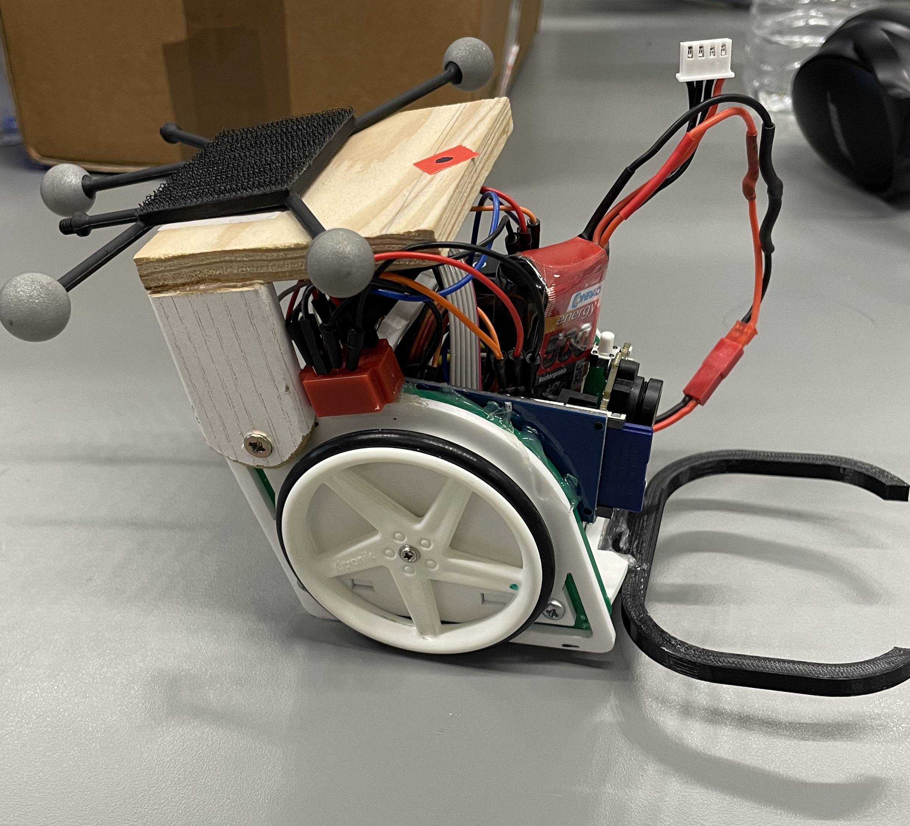
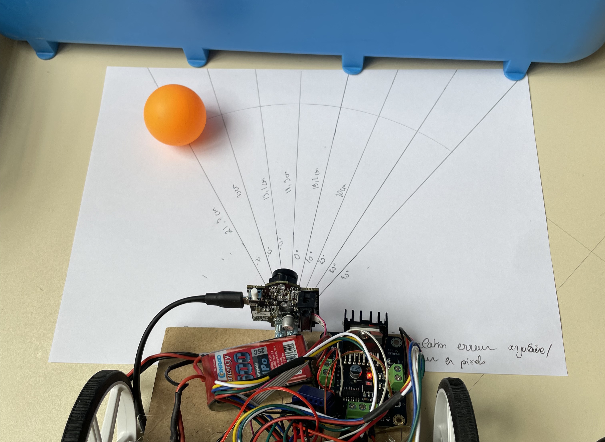
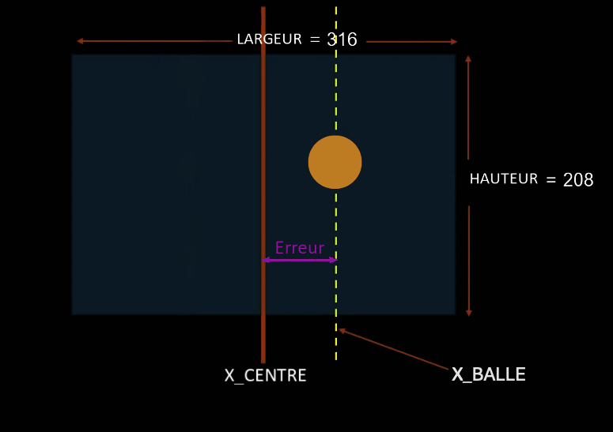
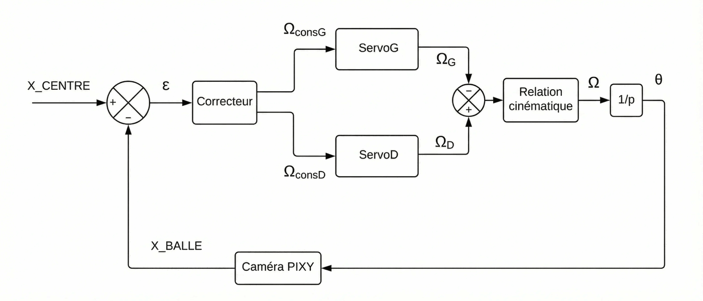
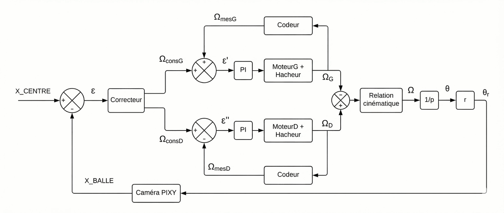
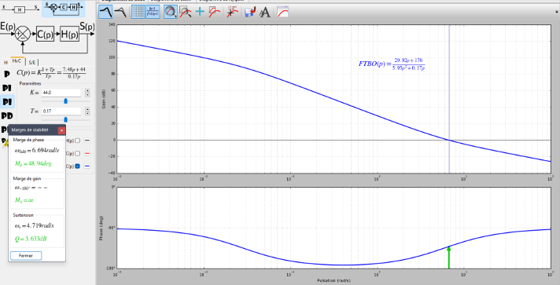
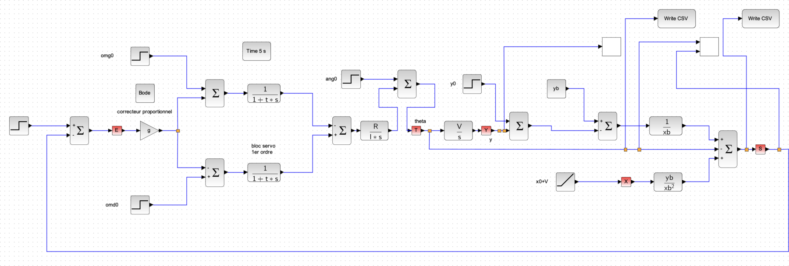
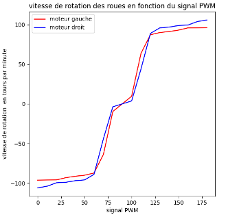
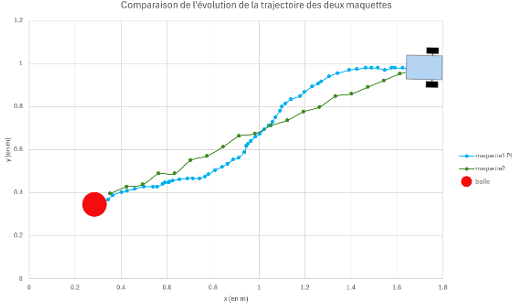

# Table Tennis Ball Collecting Robot

<p align="center">
  
  <br>
  <sub>Rendered animation of prototype 1. Bottom right: what the Pixy2 camera sees.</sub>
</p>

A small two-wheeled robot that finds a table tennis ball with a camera, drives to it and picks it up with a 3D-printed gripper. I built it on my own during my CPGE years (PSI\*), as two prototypes. For each one I wrote a model, simulated it, and checked it against measurements on the real robot.

The full report, with every equation and figure, is on my [project page](https://promaa.github.io/portfolio/projects/ball-collecting/).

| Prototype 1 | Prototype 2 |
| :---: | :---: |
|  |  |

## How it works

A Pixy2 camera looks for the orange blob and returns its position in a 316 × 208 px image. The horizontal distance between the ball and the image centre gives the bearing error:

$$\varepsilon \approx \frac{x_{ball} - x_{center}}{f_x}$$

The Arduino turns this error into a speed difference between the two wheels. The robot keeps a base speed $\Omega_0$ and turns until the ball sits in the middle of the image:

$$\Omega_{right} = \Omega_0 + K\,\varepsilon \qquad \Omega_{left} = \Omega_0 - K\,\varepsilon$$

I started with a constant gain $K$ (P control), then added an integral term (PI) to remove the remaining offset.

<p align="center"></p>

## Two prototypes

The diagrams and plots below come from my original report, so their labels are in French.



**Prototype 1** sends the guidance output straight to two hobby servos. On the bench, the right servo turned out 12 to 15 % stronger than the left one, and the left one had a wider dead zone. With P control the robot weaves around the line to the ball. PI removes the offset but pushes the servos into saturation, so the actuators became the limit.



**Prototype 2** replaces the servos with DC motors and encoders, and runs a PI speed loop on each wheel at 100 Hz. I modelled each motor as a first-order system from a step response (data in [`data/step_response.csv`](data/step_response.csv)) and tuned the speed loop on that model: Kp = 44, Ti = 0.17 s, 66° phase margin. The guidance loop then only sets wheel speed targets.

<p align="center"></p>

PI tuning workspace in PySyLiC: open-loop Bode plot of the wheel speed loop with K = 44 and T = 0.17 s.

Before testing on the floor, I simulated the whole system in Scilab Xcos:



## Results

<p align="center"></p>

Prototype 1: wheel speed against PWM command. Red is the left servo, blue the right one.

| | Prototype 1, P | Prototype 1, PI | Prototype 2 |
| --- | --- | --- | --- |
| Final error | ±2 to 3 cm | ±0.5 to 1 cm | ±0.5 to 1 cm |
| Oscillation | strong | moderate | none visible |
| What limits it | servo asymmetry and saturation | servo saturation | camera frame rate and lighting |

<p align="center"></p>

Measured paths to the same ball: prototype 1 with PI in blue, prototype 2 in green. The second prototype gets there faster and without the final oscillation. What limits it now is the camera, not the motors.

## Repository

```
firmware/prototype1/servo_guidance_pi.ino   Pixy2 guidance on the servos, P or PI, 20 Hz
firmware/prototype2/motor_speed_pi.ino      PI speed loop on each wheel with encoders, 100 Hz
modeling/kinematics_sim.py                  kinematic simulation of the guidance loop
modeling/motor_identification.py            first-order fit of the motor step response
tools/log_parser.py                         reads the serial logs of both prototypes
tools/export_gains.py                       writes tuned gains to an Arduino header
data/step_response.csv                      measured motor step response
data/proto1-runs/                           wheel commands logged by prototype 1, P and PI, static and moving ball
```

## Running the code

```bash
git clone https://github.com/promaaa/ball-collecting-robots.git
cd ball-collecting-robots
pip install -r requirements.txt

python -m modeling.kinematics_sim --kp 1.2 --ki 0.5
python -m modeling.motor_identification data/step_response.csv --plot
```

The prototype 1 firmware needs the Pixy2 Arduino library. The prototype 2 firmware needs FlexiTimer2 and uses interrupt pins 18 and 19, which exist on an Arduino Mega.

```bash
arduino-cli compile --fqbn arduino:avr:uno firmware/prototype1/servo_guidance_pi.ino
arduino-cli compile --fqbn arduino:avr:mega firmware/prototype2/motor_speed_pi.ino
```

## Next steps

- Faster and more reliable ball detection, since the camera is now the bottleneck.
- A predictive term, so the robot can intercept a ball that is still rolling.
- Battery voltage compensation.

## License

MIT, see [LICENSE](LICENSE).
